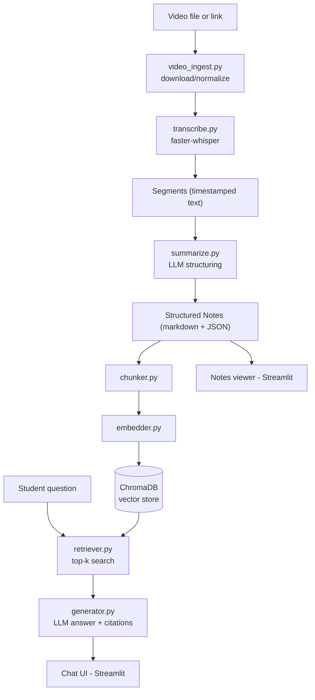

# Lecture-to-Notes + RAG Learning Assistant — Architecture & Workflow

> This file is the single source of truth for this project. Every coding agent
> (Gemini 3.1 Pro, Claude Opus 4.6, or any other) working in this repo must read
> this file first and follow it exactly — module names, function signatures,
> folder layout, and file formats below are not suggestions, they are the
> contract that keeps the two pipelines (video→notes and RAG) compatible with
> each other.

---

## 1. What this project is

A course-support tool with two coupled pipelines sharing one knowledge base:

1. **Video → Notes**: takes a lecture video (uploaded file or a link) and
   produces concise, structured, timestamp-traceable notes.
2. **RAG Assistant**: indexes those notes (+ syllabus/slides) and answers
   student questions grounded only in that course's material, citing the
   source lecture and timestamp.

The two pipelines share a knowledge base so the assistant's answers stay
grounded in what was actually taught, and update automatically as new
lectures are ingested.

---

## 2. Core concepts (plain-language, for reference)

- **Transcription**: speech → timestamped text using a local speech-to-text
  model (no internet/API cost).
- **Summarization**: an LLM turns raw transcript segments into structured
  bullet notes per topic, keeping key terms/formulae and timestamp references.
- **Chunking**: notes are split into small, semantically coherent pieces
  (chunks) so retrieval can find the *specific* relevant passage, not the
  whole document.
- **Embedding**: each chunk is converted into a vector (a list of numbers)
  that captures its meaning, so similar meanings end up numerically close.
- **Vector store**: a database optimized for "find the chunks whose vectors
  are closest to this query's vector."
- **Retrieval-Augmented Generation (RAG)**: on a student question, retrieve
  the top-k relevant chunks, then ask the LLM to answer **using only those
  chunks**, and report which lecture/timestamp each fact came from. This is
  what prevents the assistant from making things up or drifting off-syllabus.

---

## 3. Tech stack (student-project friendly — free/local wherever possible)

| Layer | Choice | Why |
|---|---|---|
| Language | Python 3.11 | Best library support for both pipelines |
| Video download | `yt-dlp` | Handles YouTube/Drive links reliably |
| Transcription | `faster-whisper` (local) | Free, no API key, timestamped output |
| Summarization LLM | Anthropic or Gemini API (pluggable) | Configurable via `.env`, no vendor lock-in |
| Embeddings | `sentence-transformers` (`all-MiniLM-L6-v2`, local) | Free, no API cost, good enough for course-scale data |
| Vector store | `ChromaDB` (embedded, persistent on disk) | No server to run, perfect for a single-course pilot |
| RAG generation LLM | Same pluggable client as summarization | Reuse one LLM abstraction everywhere |
| UI | `Streamlit` | Fastest path to a usable pilot interface, single app |
| Config | `.env` + `python-dotenv` | Keeps API keys out of code |

Do **not** introduce a different stack (e.g., a separate JS frontend, a hosted
vector DB, a different transcription engine) without updating this file first.

---

## 4. Architecture diagram



---

## 5. Folder structure

```
project-root/
├── ARCHITECTURE.md          <- this file, do not delete
├── README.md                <- short human-facing setup guide
├── requirements.txt
├── .env.example              <- template; real .env is gitignored
├── .gitignore
├── app/
│   ├── main.py                <- Streamlit entry point (tabs: Ingest / Notes / Chat)
│   ├── config.py               <- loads .env, exposes settings object
│   ├── llm_client.py            <- pluggable LLM wrapper (Anthropic / Gemini)
│   ├── pipeline/
│   │   ├── video_ingest.py        <- download_video(url_or_path) -> local_path
│   │   ├── transcribe.py           <- transcribe(video_path) -> List[Segment]
│   │   ├── summarize.py             <- generate_notes(segments, meta) -> Notes
│   │   └── notes_store.py            <- save/load notes as markdown + JSON
│   ├── rag/
│   │   ├── chunker.py                <- chunk_notes(notes) -> List[Chunk]
│   │   ├── embedder.py                <- embed(chunks) -> vectors
│   │   ├── vector_store.py             <- upsert(chunks) / query(text, k)
│   │   └── generator.py                 <- answer(query, chunks) -> {answer, sources}
│   └── ui/
│       ├── ingest_tab.py
│       ├── notes_tab.py
│       └── chat_tab.py
├── data/
│   ├── raw_videos/             <- downloaded/uploaded video files
│   ├── transcripts/             <- {lecture_id}.json (segments)
│   ├── notes/                    <- {lecture_id}.md + {lecture_id}.json
│   └── vector_db/                 <- ChromaDB persistent storage
└── tests/
    ├── test_transcribe.py
    ├── test_chunker.py
    └── test_rag_pipeline.py
```

---

## 6. Data contracts (must match exactly across modules)

**Segment** (output of `transcribe.py`):
```json
{"start": 12.4, "end": 18.9, "text": "Newton's second law states that..."}
```

**Lecture metadata** (`data/notes/{lecture_id}.json`):
```json
{
  "lecture_id": "unit3-lec4",
  "title": "Newton's Laws of Motion",
  "source": "https://youtube.com/...",
  "date": "2026-09-01",
  "transcript_path": "data/transcripts/unit3-lec4.json",
  "notes_path": "data/notes/unit3-lec4.md"
}
```

**Chunk** (output of `chunker.py`, input to `embedder.py`/`vector_store.py`):
```json
{
  "chunk_id": "unit3-lec4-003",
  "lecture_id": "unit3-lec4",
  "section_title": "Newton's Second Law",
  "timestamp_start": 340.0,
  "timestamp_end": 402.5,
  "text": "F = ma. Force is directly proportional to..."
}
```

**RAG answer** (output of `generator.py`):
```json
{
  "answer": "Newton's second law states that force equals mass times acceleration...",
  "sources": [
    {"lecture_id": "unit3-lec4", "section_title": "Newton's Second Law", "timestamp_start": 340.0}
  ]
}
```

If retrieval finds nothing relevant, `generator.py` must return an explicit
"not covered in this course's material" answer — never let the LLM fall back
to open-domain knowledge silently.

---

## 7. Environment setup (for the agent to generate, not for you to type)

- `requirements.txt` should pin: `faster-whisper`, `yt-dlp`, `chromadb`,
  `sentence-transformers`, `streamlit`, `python-dotenv`, plus whichever LLM
  SDK(s) are used (`anthropic`, `google-genai`).
- `.env.example` should list: `ANTHROPIC_API_KEY=`, `GEMINI_API_KEY=`,
  `LLM_PROVIDER=anthropic` (or `gemini`).
- A `venv` should be used; the agent should generate setup instructions in
  `README.md`, not assume you'll type commands from memory.

---

## 8. Multi-agent workflow (how you'll actually work)

You are not writing code — you relay prompts between me (Claude, planning
this project) and your coding agents. Suggested role split:

- **Gemini 3.1 Pro** → scaffolding, the video-ingestion/transcription
  pipeline, and the Streamlit UI shell. Good for broad multi-file setup.
- **Claude Opus 4.6** → the RAG module (chunking, retrieval, generation) and
  integration/testing. This is the part where grounding and correctness
  matter most.

This split is a suggestion, not a rule — if one agent is already open and
has context loaded, it's fine to keep using it across phases.

**Loop for every phase:**
1. I give you a prompt here (copy-paste block).
2. You paste it into the agent's chat in your IDE.
3. The agent writes/edits code.
4. You paste the agent's summary/output (and any errors) back to me.
5. I review, fix issues via a follow-up prompt, and give you the next phase.

Always start a *new* agent session for a new phase by first telling it to
read `ARCHITECTURE.md` in the repo root, so it has the shared contract in
context.

---

## 9. Build roadmap

| Phase | Deliverable | Suggested agent |
|---|---|---|
| 0 | Repo scaffold, folders, requirements.txt, config.py, .env.example | Gemini 3.1 Pro |
| 1 | `video_ingest.py` + `transcribe.py`, CLI-testable on one sample video | Gemini 3.1 Pro |
| 2 | `summarize.py` — transcript segments → structured notes (md + JSON) | Claude Opus 4.6 |
| 3 | `chunker.py` + `embedder.py` + `vector_store.py` (indexing works end-to-end) | Claude Opus 4.6 |
| 4 | `retriever.py` + `generator.py` — question in, grounded answer + citations out | Claude Opus 4.6 |
| 5 | Streamlit UI: Ingest tab, Notes tab, Chat tab wired to the pipelines | Gemini 3.1 Pro |
| 6 | Logging (query logs, retrieval hits) for the pilot-study data collection | Claude Opus 4.6 |
| 7 | Polish: error handling, README, sample data, basic tests | Either |

We are currently at **Phase 0**.

---

## 10. Guardrails for agents (paste-worthy, keep enforcing these)

- Follow the folder structure and function signatures in this file exactly —
  do not rename modules or change return shapes without flagging it.
- No hardcoded API keys; everything through `.env` / `config.py`.
- The RAG generator must never answer from outside the retrieved context.
- Every module should be runnable/testable on its own (e.g., `python -m
  app.pipeline.transcribe path/to/video.mp4`) before being wired into the UI.
- Keep functions small and typed (use Python type hints) so later phases can
  import them cleanly.
- After finishing a phase, the agent should summarize: what was created,
  how to run/test it, and any open questions — that summary is what you paste
  back to me.
